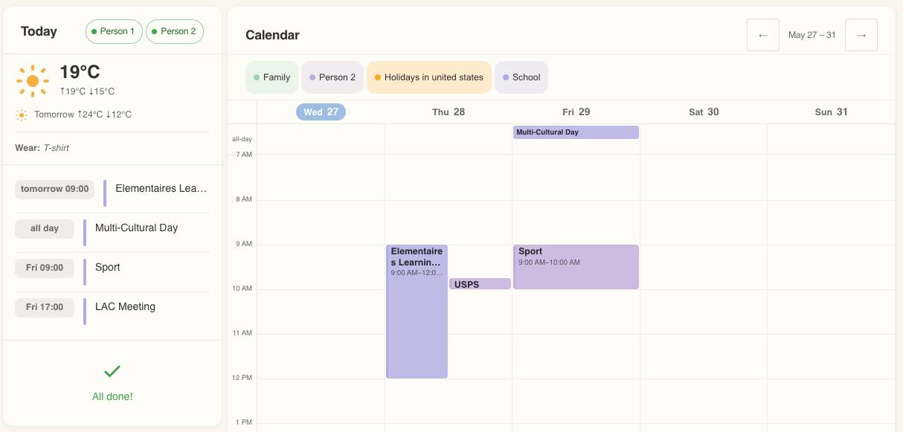
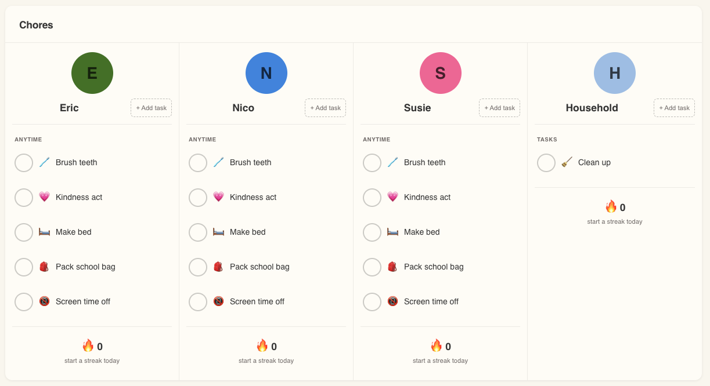

# ha-lucarne — Family Calendar & Chores Dashboard for Home Assistant

<a href="https://my.home-assistant.io/redirect/hacs_repository/?owner=molant&repository=ha-lucarne&category=integration"></a>
<a href="https://opensource.org/licenses/MIT"></a>
<a href="https://www.home-assistant.io/"></a>

**ha-lucarne** turns a tablet into a family command center, all driven from Home Assistant. You install
**one thing** — the `lucarne_family` integration — and it brings two parts with it:

- The **integration** owns your family in one place — members, their colors and avatars, their
  per-person to-do lists and streak counters, and the daily routine reset and streak checks.
- Three **Lovelace cards** — a rolling multi-day **calendar**, a **today** agenda with weather, and a
  per-member **chores & routines** tracker — render that state on a tablet in landscape/kiosk mode.
  The cards ship inside the integration and register themselves automatically, so there's no separate
  download and no Lovelace resource to add by hand.

Add a family member and the integration does the plumbing for you: it creates their `todo.<slug>`
list, their `counter.<slug>_streak` counter, and seeds their starter routines — no manual helpers,
no scattered automations.

---

## Screenshots

**Today + Calendar** — daily agenda, current weather and tomorrow's forecast, and a rolling calendar
that auto-fits 3–7 days to the screen width with per-person color coding:



**Chores** — per-member routines and chores grouped by time of day, with emoji icons, one-tap
check-off, and a streak counter per person:



---

## Features

### Family, managed for you (the integration)

- **One config, no manual helpers** — add a member and you automatically get their `todo.<slug>`
  list, `counter.<slug>_streak` counter, and seeded starter routines.
- **Everything in one dialog** — name, color, avatar, and routine preset live under
  **Settings → Devices & Services → Lucarne Family → Configure**, not scattered across Helpers.
- **Avatars with a real crop UI** — upload a photo from the chores-card editor and position/resize it
  in a square crop dialog (the same cropper Home Assistant uses internally), or just pick an emoji.
- **Routine presets** — start members from built-in presets (school-age kid, toddler, adult), or
  create, rename, and delete your own custom presets and reuse them across members.
- **Managed daily reset & streaks** — routines reset every morning (04:00 default) and streaks are
  checked each night (21:00 default) by in-process listeners. Times are editable in the dialog, no
  restart needed. There are no blueprint instances to babysit.
- **Rename with an impact preview** — renaming a member shows which automations, scripts, and
  dashboards reference the old entity IDs before anything changes.

### `lucarne-calendar-card`

- Rolling N-day window with touch swipe; auto-fits 3–7 day columns to the available width.
- Per-person color coding and toggle pills to show/hide each calendar.
- Event-detail popover and a create-event flow on calendars that support it.
- Optional cropping of the time grid to your waking hours (`visible_hours`).

### `lucarne-today-card`

- Agenda strip for the next several days with per-person color dots.
- Today's weather plus tomorrow's forecast and a "what to wear" hint.
- Rich Tasks list: 44px tap targets, owner avatar pills, tap to check off, long-press for the
  full more-info dialog.
- Draggable section order so you can arrange calendar / weather / tasks to taste.
- Optional household task pane and an "N of M ready" family-ready pill sourced from the integration.

### `lucarne-chores-card`

- Per-member grid of routines and chores, grouped by **time of day** (Morning → Afternoon → Night →
  Anytime), with empty buckets hidden.
- Friendly recurrence labels ("every Monday", "every 6 months", …) and emoji icons.
- One-tap **+ Add task** from the card; long-press any task to edit or delete it.
- Per-member **streak counter** with a celebration animation when a member finishes their routines.
- Reorder members and scroll horizontally on tablets instead of wrapping rows.
- Includes an optional shared **Household** column.

### Apple Reminders bridge

- A Mac mini Shortcut + launchd job syncs Apple Reminders into Home Assistant `todo` entities every
  five minutes, so reminders you add on your phone show up on the family dashboard.

### Polished for tablets

- A design-token layer (spacing, radii, typography, palette) keeps the cards consistent across tablet
  breakpoints, and an optional pastel **Lucarne theme** pairs the cards with the palette they were
  designed against.

---

## Install

The cards are bundled inside the integration, so there's a single HACS install — no separate
dashboard download and no manual Lovelace resource.

### Step 1 — Install via HACS

[](https://my.home-assistant.io/redirect/hacs_repository/?owner=molant&repository=ha-lucarne&category=integration)

The button opens HACS in your Home Assistant and pre-fills this repository (it works without the repo
being in the default HACS index) — then click **Download**. To do it by hand instead:

1. Open HA → **HACS** → **Integrations**
2. Click the three-dot menu (⋮) → **Custom repositories**
3. Paste `https://github.com/molant/ha-lucarne` and set Type to **Integration**
4. Click **Add**, then search for **Lucarne Family** and click **Download**

> Prefer not to use HACS at all? Copy `custom_components/lucarne_family/` from the repo into your HA
> config's `custom_components/` directory.

### Step 2 — Restart Home Assistant

Restart HA (**Settings → System → Restart**). On restart the integration registers the cards
automatically — there is no Lovelace resource to add.

### Step 3 — Configure the Lucarne Family integration

1. Go to **Settings → Devices & Services → Add Integration**
2. Search for **Lucarne Family** and click it
3. Enter your family name (e.g. "The Smiths") and click **Submit**
4. Open the integration's **Configure** dialog to add family members (see [Family configuration](#family-configuration) below)

### Step 4 — Add cards to your dashboard

Open your dashboard in edit mode and add the cards via YAML (see [Configuration](#configuration)).
Each card has a visual editor — click **Visual editor** after adding.

### Step 5 — (Optional) Apply the Lucarne theme

The integration ships a pastel **Lucarne** theme and registers it automatically — no
`configuration.yaml` edits and no manual file copy. It pairs the cards with the calm cream/pastel
palette they were designed against and widens HA's `type: sections` views past the default 500px cap
(via `ha-view-sections-column-max-width: 1200px`) so cards render side-by-side at full tablet width.

Just select it per-user: **Profile → Theme → Lucarne**.

> The theme is registered in-process at startup. If you run **Developer tools → Actions →
> `frontend.reload_themes`**, HA rebuilds its theme list from `configuration.yaml` and the bundled
> theme disappears until the next Home Assistant restart re-registers it. To make the theme survive a
> manual reload (or to tweak the palette), copy
> `custom_components/lucarne_family/themes/lucarne.yaml` into your `<config>/themes/` directory and add
> `frontend: { themes: !include_dir_merge_named themes }` to `configuration.yaml`.

### Step 6 — (Optional) Set up the Mac mini Reminders bridge

Follow [bridge/README.md](bridge/README.md) to install the launchd sync job on a Mac mini.
Skip this step if you prefer to manage todo items directly in HA.

---

## Family configuration

Open **Settings → Devices & Services → Lucarne Family → Configure** to manage members.

### Add a member

1. Choose **Manage members → Add member**
2. Fill in name, color, and routine preset:
   - **School-age kid** — brush teeth, make bed, pack school bag (weekdays), screen time off
   - **Toddler** — brush teeth, get dressed, put toys away
   - **Adult (none)** — empty
3. Click **Submit**. The integration creates `todo.<slug>`, `counter.<slug>_streak`, and seeds
   preset routines.
4. Set the member's avatar (photo with crop, or emoji) from the chores-card editor.

### Edit schedule

Choose **Edit schedule** to adjust the daily reset time (default `04:00`) and streak check time
(default `21:00`). Changes take effect immediately — no HA restart needed.

### Routine presets

Choose **Routine presets** to view the built-in presets, or create / edit / delete your own custom
presets and reuse them when adding members.

See [docs/integration.md](docs/integration.md) for the full member management, rename, and
remove workflows.

---

## Configuration

### `lucarne-today-card`

```yaml
type: custom:lucarne-today-card
title: Today            # optional, default "Today"
calendars:
  # Display names come from each calendar's friendly_name in HA — rename via
  # Settings → Devices & services → Entities. The label: field is deprecated
  # and ignored; safe to remove from existing configs.
  - entity: calendar.family
    color: "#a8d8b9"    # any CSS color; shown as left-border dot on events
  - entity: calendar.ingrid
    color: "#c8b4e0"
weather: weather.forecast_home      # optional
tasks: todo.ingrid_tasks            # optional; shows task-count badge (raw todo entity mode)
presence:                           # optional; shows home/away pills in header
  - entity: binary_sensor.molant_home
    name: M
  - entity: binary_sensor.ingrid_home
    name: I
agenda_limit: 5                     # optional, default 5
section_order:                      # optional; drag to reorder in the visual editor
  - calendar
  - weather
  - tasks

# Lucarne Family integration toggles (both default false; require the integration)
household_tasks_from_integration: false   # if true, ignores tasks: and shows household tasks from integration
show_family_ready_pill: false             # if true, shows N/M ready pill in header
```

> **Backward compat**: `tasks: todo.ingrid_tasks` (raw entity mode) continues to work. Setting
> `household_tasks_from_integration: true` replaces it with the integration-backed household list.

### `lucarne-calendar-card`

```yaml
type: custom:lucarne-calendar-card
title: Calendar         # optional, default "Calendar"
calendars:
  - entity: calendar.family
    color: "#a8d8b9"
  - entity: calendar.ingrid
    color: "#c8b4e0"
  - entity: calendar.anton
    color: "#a8c5e8"
visible_hours:          # optional; crop the time grid to these hours
  start: "07:00"
  end:   "21:00"
# Rolling window options (all optional — defaults shown):
min_days: 3             # never show fewer day columns than this
max_days: 7             # cap at this many columns even on wide screens
min_col_width: 140      # refuse to make columns narrower than this (px)
max_col_width: 220      # show more days if columns would be wider than this (px)
show_create_button: true  # optional; shows a + button on empty slots
# NOTE: week_starts_on is deprecated and silently ignored
```

### `lucarne-chores-card`

> **Requires the Lucarne Family integration** to be set up (Step 3 above). Without it the card shows
> an error block. Old YAML configs with a `kids:` array also show an upgrade block.

```yaml
type: custom:lucarne-chores-card
title: Chores           # optional, default "Chores"
members:                # slugs of members to show — must match integration members
  - anna
  - bob
  - household           # optional; shows the shared todo.lucarne_household list
show_routines: true     # optional, default true
show_tasks: true        # optional, default true
show_streak: true       # optional, default true
```

Member slugs are derived from names entered in the integration (e.g. "Anna" → `anna`).
The visual editor populates and reorders the member list from the integration automatically.

---

## Blueprints

One automation blueprint lives in `blueprints/automation/`. Import it via HA:

**Settings → Automations → Blueprints → Import Blueprint** and paste the raw GitHub URL:

- `lucarne_reminders_sync` — webhook receiver: upserts the Mac mini's Reminders payload into HA
  `local_todo` entities. Inputs: Webhook ID + `list_mappings` JSON (e.g.
  `{"Family": "todo.anna", "Groceries": "todo.groceries"}`).

> Daily reset and streak checks are owned by the `lucarne_family` integration — there are no
> blueprints to maintain for those.

---

## Custom events

The `lucarne_family` integration fires `lucarne_family_all_routines_done` when all of a member's
routines complete for the day.

See [docs/events.md](docs/events.md) for the full schema and a TTS example automation.

---

## Troubleshooting

**Cards show "Custom element not defined"**
The integration registers the cards on startup, so make sure you **restarted HA** after installing
(Step 2) and that the integration is set up. Then hard-refresh the browser (Cmd+Shift+R) to clear the
cached bundle. You can confirm the bundle is served by opening `/lucarne_family_frontend/ha-lucarne.js`
in your browser — it should return JavaScript, not a 404.

**Chores card shows "Lucarne Family integration not set up"**
Add and configure the integration (Step 3 above). The card requires it; other cards do not.

**Reminders not syncing**
1. `launchctl list | grep ha-lucarne-sync` — check exit code is 0
2. `tail ~/Library/Logs/ha-lucarne-sync.log` — non-200 HTTP errors are logged here
3. Shortcuts.app must have been launched manually at least once after each macOS major upgrade

**Items appear duplicated in HA**
The `lucarne_reminders_sync` blueprint uses Apple Reminder UID for deduplication. If you see
duplicates, check the automation traces — the Shortcut must send unique `id` values.

**Google Calendar polling delay (up to 15 min)**
HA's Google Calendar integration polls on a fixed schedule. This is a HA core limitation.

**Mac mini sleeps and sync stops**
System Settings → Lock Screen → set "Put computer to sleep when display is off" to **Never**.

---

## License

[MIT](LICENSE)
